# Execution Plan

## Detailed Analysis Summary

### Change Impact Assessment
- **User-facing changes**: Yes — 전체 웹 UI 신규 구축
- **Structural changes**: Yes — 프론트엔드/백엔드/DB 전체 아키텍처 신규
- **Data model changes**: Yes — 소비 내역, 카드, 카테고리, 사용자 테이블 설계 필요
- **API changes**: Yes — REST API 전체 신규 설계
- **NFR impact**: No — 단순 CRUD + 통계, 특별한 NFR 요구 없음

### Risk Assessment
- **Risk Level**: Low (Greenfield, 단순 CRUD + 통계)
- **Rollback Complexity**: Easy (신규 프로젝트)
- **Testing Complexity**: Simple

---

## Workflow Visualization

```mermaid
flowchart TD
    Start(["User Request"])
    
    subgraph INCEPTION["🔵 INCEPTION PHASE"]
        WD["Workspace Detection<br/><b>COMPLETED</b>"]
        RA["Requirements Analysis<br/><b>COMPLETED</b>"]
        US["User Stories<br/><b>COMPLETED</b>"]
        WP["Workflow Planning<br/><b>COMPLETED</b>"]
        AD["Application Design<br/><b>EXECUTE</b>"]
        UG["Units Generation<br/><b>EXECUTE</b>"]
    end
    
    subgraph CONSTRUCTION["🟢 CONSTRUCTION PHASE"]
        FD1["Functional Design<br/>Unit 1: Backend+DB<br/><b>EXECUTE</b>"]
        CG1["Code Generation<br/>Unit 1: Backend+DB<br/><b>EXECUTE</b>"]
        FD2["Functional Design<br/>Unit 2: Frontend<br/><b>EXECUTE</b>"]
        CG2["Code Generation<br/>Unit 2: Frontend<br/><b>EXECUTE</b>"]
        BT["Build and Test<br/><b>EXECUTE</b>"]
    end
    
    Start --> WD
    WD --> RA
    RA --> US
    US --> WP
    WP --> AD
    AD --> UG
    UG --> FD1
    FD1 --> CG1
    CG1 --> FD2
    FD2 --> CG2
    CG2 --> BT
    BT --> End(["Complete"])
    
    style WD fill:#4CAF50,stroke:#1B5E20,stroke-width:3px,color:#fff
    style RA fill:#4CAF50,stroke:#1B5E20,stroke-width:3px,color:#fff
    style US fill:#4CAF50,stroke:#1B5E20,stroke-width:3px,color:#fff
    style WP fill:#4CAF50,stroke:#1B5E20,stroke-width:3px,color:#fff
    style AD fill:#FFA726,stroke:#E65100,stroke-width:3px,stroke-dasharray: 5 5,color:#000
    style UG fill:#FFA726,stroke:#E65100,stroke-width:3px,stroke-dasharray: 5 5,color:#000
    style FD1 fill:#FFA726,stroke:#E65100,stroke-width:3px,stroke-dasharray: 5 5,color:#000
    style CG1 fill:#4CAF50,stroke:#1B5E20,stroke-width:3px,color:#fff
    style FD2 fill:#FFA726,stroke:#E65100,stroke-width:3px,stroke-dasharray: 5 5,color:#000
    style CG2 fill:#4CAF50,stroke:#1B5E20,stroke-width:3px,color:#fff
    style BT fill:#4CAF50,stroke:#1B5E20,stroke-width:3px,color:#fff
    style Start fill:#CE93D8,stroke:#6A1B9A,stroke-width:3px,color:#000
    style End fill:#CE93D8,stroke:#6A1B9A,stroke-width:3px,color:#000
    style INCEPTION fill:#BBDEFB,stroke:#1565C0,stroke-width:3px,color:#000
    style CONSTRUCTION fill:#C8E6C9,stroke:#2E7D32,stroke-width:3px,color:#000
    
    linkStyle default stroke:#333,stroke-width:2px
```



### Text Alternative
```
Phase 1: INCEPTION
- Workspace Detection (COMPLETED)
- Requirements Analysis (COMPLETED)
- User Stories (COMPLETED)
- Workflow Planning (COMPLETED)
- Application Design (EXECUTE)
- Units Generation (EXECUTE)

Phase 2: CONSTRUCTION
- Unit 1 (Backend+DB):
  - Functional Design (EXECUTE)
  - Code Generation (EXECUTE)
- Unit 2 (Frontend):
  - Functional Design (EXECUTE)
  - Code Generation (EXECUTE)
- Build and Test (EXECUTE)
```

---

## Phases to Execute

### 🔵 INCEPTION PHASE
- [x] Workspace Detection (COMPLETED)
- [x] Requirements Analysis (COMPLETED)
- [x] User Stories (COMPLETED)
- [x] Workflow Planning (COMPLETED)
- [ ] Application Design - EXECUTE
  - **Rationale**: 신규 프로젝트로 컴포넌트 구조, API 설계, 서비스 레이어 정의 필요
- [ ] Units Generation - EXECUTE
  - **Rationale**: 프론트엔드 유닛과 백엔드+DB 유닛으로 분리하여 개발

### 🟢 CONSTRUCTION PHASE
- [ ] Functional Design - EXECUTE (per-unit)
  - **Rationale**: 각 유닛별 데이터 모델, API/컴포넌트 상세 설계 필요
- ~~NFR Requirements~~ - SKIP
  - **Rationale**: 특별한 성능/보안 요구 없음, 보안 확장 미적용
- ~~NFR Design~~ - SKIP
  - **Rationale**: NFR Requirements 미실행
- ~~Infrastructure Design~~ - SKIP
  - **Rationale**: Docker Compose로 단순 배포, 별도 인프라 설계 불필요
- [ ] Code Generation - EXECUTE (per-unit, ALWAYS)
  - **Rationale**: 각 유닛별 코드 생성
- [ ] Build and Test - EXECUTE (ALWAYS)
  - **Rationale**: 빌드 및 테스트 지침 생성

---

## Unit Breakdown
| Unit | 범위 | 설명 |
|------|------|------|
| Unit 1: Backend + DB | FastAPI + MySQL | API 서버, 데이터 모델, DB 스키마 |
| Unit 2: Frontend | Vue.js | 웹 UI, 차트, API 연동 |

**실행 순서**: Unit 1 (Backend+DB) → Unit 2 (Frontend)  
**이유**: 프론트엔드가 백엔드 API에 의존하므로 백엔드를 먼저 구현

---

## Success Criteria
- **Primary Goal**: 월별/연간 소비 기록 및 통계 확인이 가능한 가계부 웹 서비스
- **Key Deliverables**: Vue.js 프론트엔드, FastAPI 백엔드, MySQL DB, Docker Compose 설정
- **Quality Gates**: 모든 CRUD 동작, 필터링, 통계 차트 정상 작동
- **Units**: Backend+DB (Unit 1) → Frontend (Unit 2) 순서로 구현
